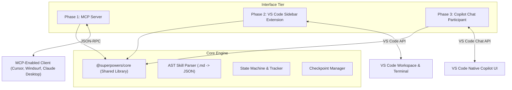

# Architecture & Design Specification: Reimagined Superpowers Suite

This document defines the comprehensive architecture, design specifications, and implementation phases for the reimagined **Superpowers** suite. The goal is to build a model-agnostic, interactive, and autonomous AI-agent workflows ecosystem in VS Code and beyond, surpassing the limitations of the original `dwaintr.superpowers-vscode` extension.

---

## 1. System Overview & Core Architecture

The system is decomposed into a modular, multi-tiered architecture to maximize reusability across different interfaces (CLI, VS Code native chat, MCP clients, and custom webview sidebars).



### Key Differences from Existing Extensions
| Feature | Original Extension (`dwaintr.superpowers-vscode`) | Reimagined Superpowers Suite |
| :--- | :--- | :--- |
| **Model Choice** | Locked to GitHub Copilot's provided models. | Model-agnostic (Gemini, Claude, DeepSeek, OpenAI, Ollama). |
| **UI Experience** | Standard vertical scroll chat pane in VS Code. | Dedicated Sidebar Webview with interactive checklists, diffs. |
| **Tool Execution** | Read-only / suggestions; user must execute. | Autonomous tool execution (file editing, terminal running). |
| **Protocol** | VS Code Chat Participant API only. | Built on Model Context Protocol (MCP) + VS Code APIs. |
| **State Persistence**| Volatile (bound to active chat thread). | Local folder checkpoints (`.superpowers/sessions/*.json`). |

---

## 2. The Core Engine (`@superpowers/core`)

The Core Engine is a platform-independent library written in TypeScript. It handles parsing skills, managing execution state, and maintaining session checkpoints.

### 2.1 AST Skill Parser
The parser processes standard `SKILL.md` files (which follow the Jesse Vincent Markdown style) and compiles them into a structured JSON Abstract Syntax Tree (AST).

*   **Frontmatter Parsing:** Extracts metadata (name, description, required workspace state).
*   **Step Extraction:** Identifies step boundaries (e.g., `# Step Name` or `## Step Name`).
*   **Checklist Extraction:** Parses markdown task lists (`- [ ]`) into explicit schema items.
*   **Gate Parsing:** Detects `<HARD-GATE>` tags or rigid enforcement rules.

#### Parsed Schema Definition (`types.ts`):
```typescript
interface Skill {
  id: string;
  name: string;
  description: string;
  rawContent: string;
  metadata: {
    rigid: boolean;
    requiredTools?: string[];
  };
  steps: SkillStep[];
}

interface SkillStep {
  index: number;
  title: string;
  description: string;
  checklist: ChecklistItem[];
  gates: GateCondition[];
}

interface ChecklistItem {
  id: string;
  text: string;
  completed: boolean;
}

interface GateCondition {
  type: 'user_approval' | 'verification_success' | 'assertion_check';
  expression?: string;
}
```

### 2.2 State Machine & Tracker
Tracks execution state. It enforces transition rules, ensuring that if a step has a `<HARD-GATE>`, the engine blocks transitions to subsequent steps until verification rules are met.
*   **Active Step Pointer:** Stores the active index.
*   **Rule Engine:** Evaluates checklist items.
*   **Transition Validator:** Checks if the transition from `Step N` to `Step N+1` is valid.

### 2.3 Checkpoint Manager
Saves progress in a hidden folder inside the active project directory: `.superpowers/sessions/<session-id>.json`.
This allows users to interrupt tasks, close the editor, switch git branches, and resume exactly where they left off.

---

## 3. Phase 1: Core MCP Server

The Model Context Protocol (MCP) server enables any compatible AI client (Claude Desktop, Cursor, Windsurf, etc.) to use Superpowers workflows. It communicates over standard I/O (JSON-RPC).

```
[MCP Client] <--- JSON-RPC over Standard I/O ---> [Superpowers MCP Server]
                                                           |
                                                [Engine (@superpowers/core)]
```

### 3.1 Exposed Tools
The server registers the following schema-defined tools:

1.  `list_skills`
    *   **Description:** Scans the global (`~/.config/superpowers/skills`) and workspace-local (`.superpowers/skills`) directories.
    *   **Input:** None.
    *   **Output:** List of parsed skills with names and descriptions.
2.  `start_session`
    *   **Description:** Starts a new workflow session for a specific skill.
    *   **Input:** `{ skillId: string, workspacePath: string }`
    *   **Output:** Session state, including the first step's checklist.
3.  `update_checklist`
    *   **Description:** Checks or unchecks specific items in the active step.
    *   **Input:** `{ sessionId: string, stepIndex: number, completedItemIds: string[] }`
    *   **Output:** Updated session status.
4.  `verify_step`
    *   **Description:** Evaluates if the current step satisfies gates (e.g. running test commands).
    *   **Input:** `{ sessionId: string, stepIndex: number }`
    *   **Output:** `{ success: boolean, errors?: string[] }`

### 3.2 Dynamic Context injection
When an agent calls an MCP tool, the server dynamically injects the relevant section of the `SKILL.md` into the agent's context. This prevents "context bloat" because the agent only sees instructions for the *current step* instead of reading a 200-line markdown file for every response.

---

## 4. Phase 2: Standalone VS Code Extension (Sidebar Webview)

This is the most feature-rich version. It provides a visual dashboard alongside the codebase.

```
+------------------------------------------+
|  SUPERPOWERS AGENT             [X] [?]   |
+------------------------------------------+
|  ACTIVE SKILL: Test-Driven Development   |
|  [|||||||||||||||----------] 60%         |
+------------------------------------------+
|  [x] 1. Create a failing test case       |
|  [/] 2. Run the test to verify failure   |
|      -> Output: Test failed (expected 4) |
|  [ ] 3. Write implementation code        |
|  [ ] 4. Run test to verify success       |
+------------------------------------------+
|  CHAT PANEL                              |
|  Agent: I ran npm test. The test fails   |
|  as expected. Ready to implement?        |
|  [ Yes, write code ] [ Run test again ]  |
+------------------------------------------+
```

### 4.1 UI Component Stack
*   **Framework:** React + Vite.
*   **Styling:** Vanilla CSS (leveraging VS Code's CSS variables, e.g., `--vscode-sideBar-background`, `--vscode-button-background` for seamless theme matching).
*   **Interactions:** Webview messaging via `postMessage`.

### 4.2 Webview Views
1.  **Dashboard/Checklist View:** Shows the current phase progress bar, active checklist, and step gates.
2.  **Interactive Chat Panel:** Standard chat interface to talk to the agent.
3.  **Local Tool runner overlay:** Shows terminal executions (e.g., test runs) with exit codes and raw logs.
4.  **Session History Tab:** List of previous sessions with options to restore or compare them.

### 4.3 VS Code API Tooling Integrations
Unlike sandboxed Copilot Chat, this extension has full access to the VS Code API:
*   **File I/O System:** Read and write files directly (using `vscode.workspace.fs`).
*   **Native Terminal Runner:** Executes commands (like `npm test`) using `vscode.window.createTerminal` or `child_process` and streams output back to the LLM.
*   **Inline Diff Editor:** Open a native VS Code diff window (`vscode.commands.executeCommand('vscode.diff', ...)`), showing modifications before committing.

---

## 5. Phase 3: VS Code Chat Participant

This phase targets developers who prefer the built-in VS Code Copilot Chat window (`Ctrl+I` or `Ctrl+Alt+I`).

### 5.1 Registration & Commands
Uses VS Code's `vscode.chat.registerChatParticipant` API to register the `@superpowers` participant.
```typescript
export function activate(context: vscode.ExtensionContext) {
    const handler: vscode.ChatRequestHandler = async (request, context, response, token) => {
        // Route requests based on slash commands
        if (request.command === 'brainstorm') {
            return runBrainstormingWorkflow(request, response);
        } else if (request.command === 'tdd') {
            return runTddWorkflow(request, response);
        }
        // Fallback default chat handler
    };
    const participant = vscode.chat.createChatParticipant("superpowers.chat", handler);
}
```

### 5.2 Slash Commands Map
*   `@superpowers /brainstorm` - Initializes a design session.
*   `@superpowers /tdd` - Kicks off a test-driven development loop.
*   `@superpowers /debug` - Performs root-cause analysis on a selected error message.
*   `@superpowers /status` - Renders the active checklist directly in the chat panel.

### 5.3 UX Enhancements (File Integration)
Since chat participants cannot write files directly, the participant uses:
*   `ChatResponseStream.button`: Emits action buttons (e.g., "Write Test File", "Run Local Tests"). Clicking these triggers local tasks via the extension side.
*   **VS Code Terminal Integration:** Binds buttons to trigger shell scripts that execute local testing.

---

## 6. Security, Safety, & Sandbox Rules

Executing local code or commands requires strict safety boundaries.

1.  **Command Execution Guard:** The agent can never execute shell commands silently. Commands must be displayed in a VS Code dialog box with `Approve` / `Deny` choices.
2.  **File Modification Limits:** The agent cannot write to folders outside the user's current workspace directory.
3.  **API Key Encryption:** User API keys are stored securely using VS Code's native `ExtensionContext.secrets` API (which ties into Windows Credential Manager / macOS Keychain).

---

## 7. Verification & Testing Plan

### 7.1 Automated Tests
*   **Core Engine:** Unit tests in Jest/Vitest simulating various parsing inputs (`SKILL.md` edge cases, empty frontmatter, nested markdown lists).
*   **MCP Protocol Verification:** Integration tests using `@modelcontextprotocol/sdk` to verify standard JSON-RPC payloads.
*   **VS Code Command Integration:** Mock VS Code API calls to verify terminal triggers and file creation logic.

### 7.2 Manual Verification
*   **Cross-Model Compatibility:** Test the agent's behavior using Gemini Pro, Claude Sonnet, and GPT-4o to verify that formatting and rule-adherence are model-agnostic.
*   **Resiliency Tests:** Interrupt a workflow mid-execution (kill terminal, reload VS Code window) and verify that checkpoint recovery restores 100% of the session state.
